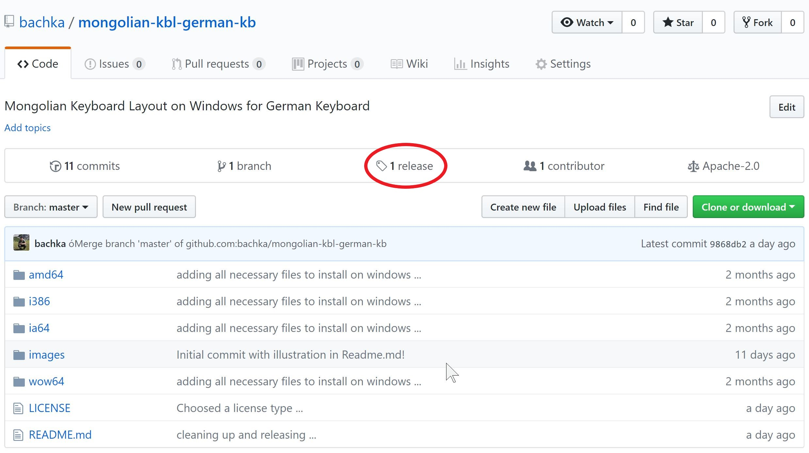
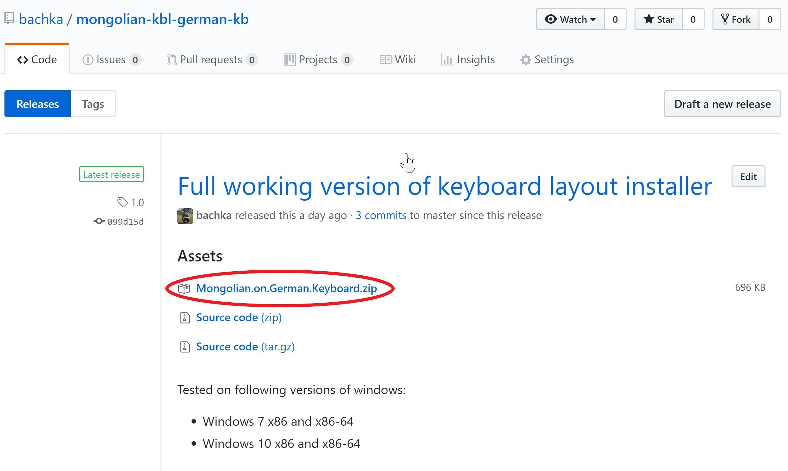
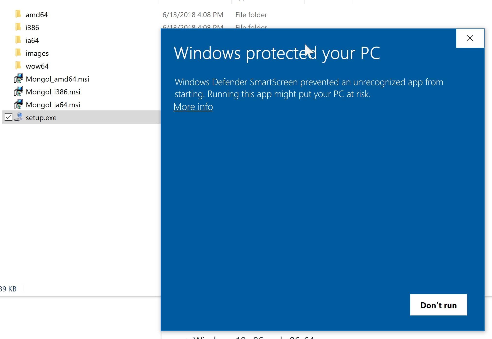
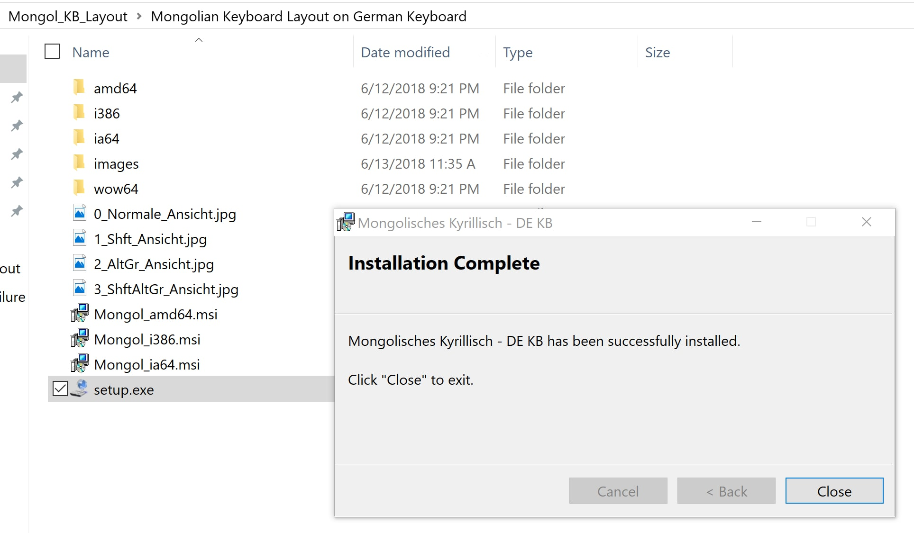
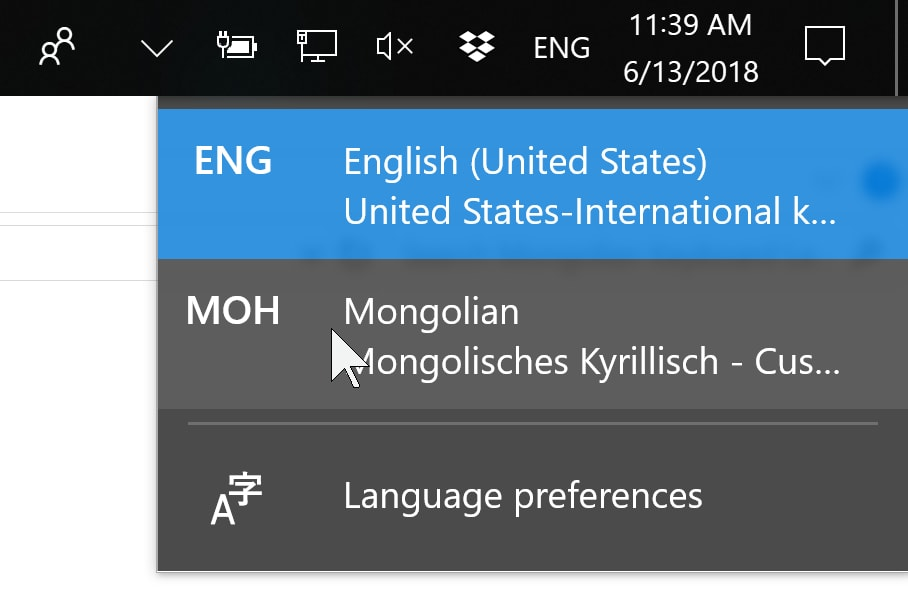
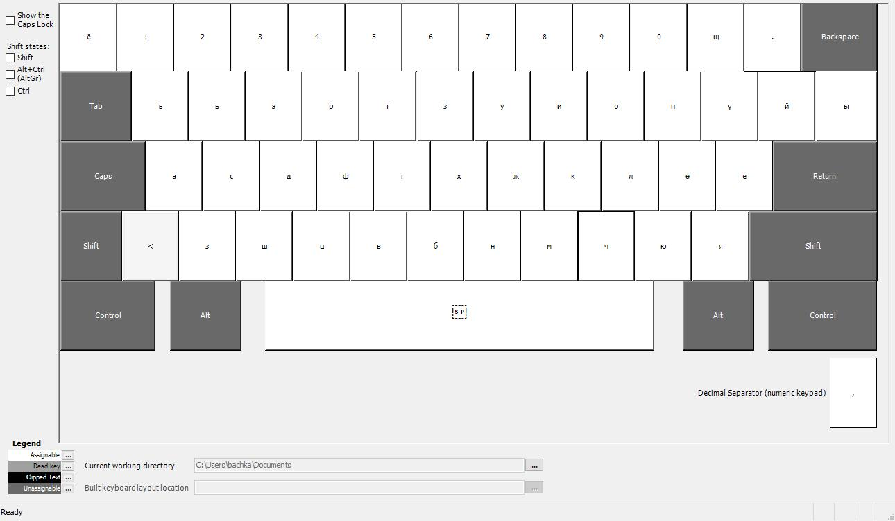
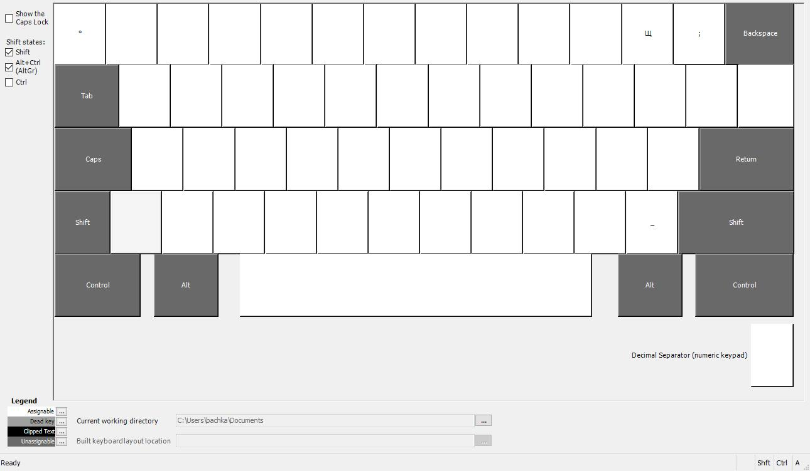
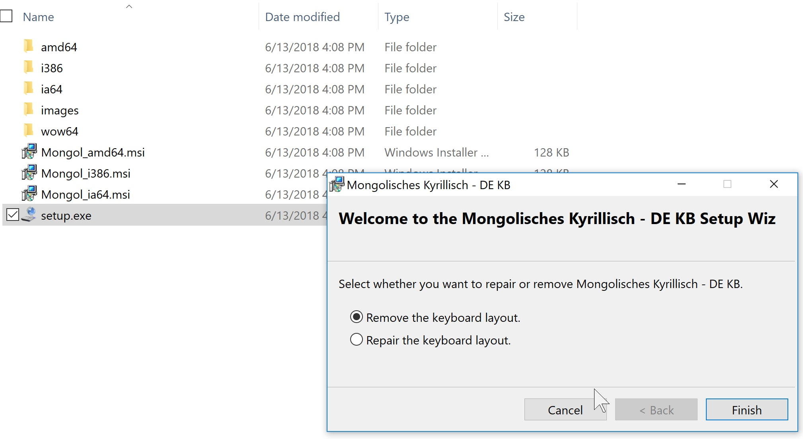
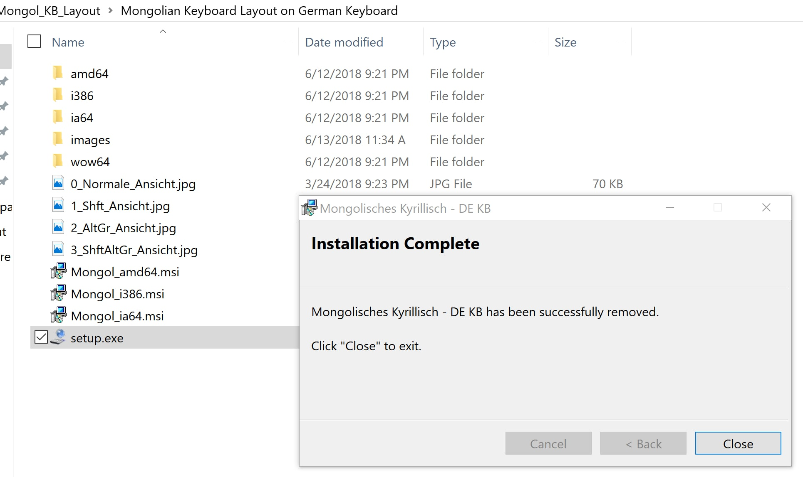
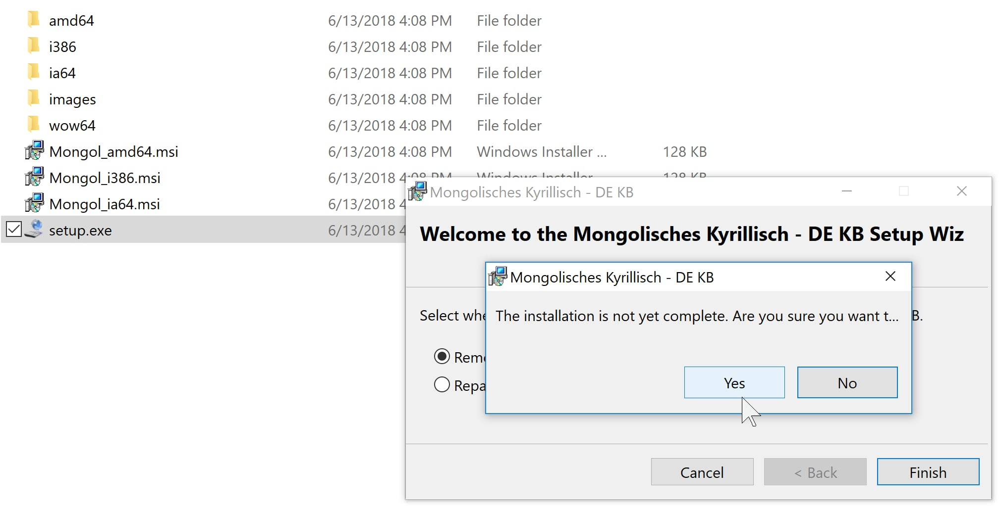

# Mongolian custom Keyboard Layout on Windows for German Keyboard
### This is the custom keyboard Layout of me for Mongolian Language
>_Tested on Windows 7, 10 Versions, but use it without any warranty_, 🤣😂!
>_If you have any questions, write me a message! I will see what i can do to fix this!_
- - -
Languages:
+ Монгол хэл дээр унших
+ Read in English

#### List of Contents

+ [Where to download](#where-to-download)
+ [How to install](#how-to-install)
+ [How to use](#how-to-use)
+ [Which key where setted can you see on pictures below](#which-key-where-setted-can-you-see-on-pictures-below)
+ [How to remove or repair](#how-to-remove-or-repair)
+ [ToDo](#todo)
+ [History](#history)
- - -
### Where to download

 1. Click on the over here on release

 2. Now you can download the zippped version of mongolian custom keyboard layout. 
+ After the download finished just extract it and follow the instructions below. 
- - -
### How to install

 1. Start Installer with setup.exe . Sometimes you will become such message, where you must click on "More Info" to start ...  

 2. Now we become a button "Run anyway" then click on that ...  

 3. After you accepted with administrator permission the installer shows that it successful installed message ...  
+ Maybe it is better if you reboot your computer or notebook. That would help windows to check that there what new installed and show in system status bar. Like on the picture below.

 4. Reboot and check that it worked!

- - -

### Which key where setted can you see on pictures below

+ Normally to switch between or in language list which you already installed use the key combination "Shift + Alt" on the left side of your keyboard.
+ Remember in every application where you want use a different language you should switch the language every time.
+ Maybe you should print the picture with the keyboard layout to check which keys where to find. Because the old or the standard layout of microsoft made just very poor. Maybe it was a person who never learned a foreign language and studied nothing. Yes, it is Microsoft!

 1. Normal Look  

 2. With Shift key  

 3. With Alt Gr  

 4. With Schift + Alt Gr  

- - -

### How to remove or repair

+ To remove the installation use the installer again. Just start setup.exe again and then you will see a windows on picture below
 1. To remove or repair the installation  

 2. Removed successful  

 3. Or you can just cancel it  
- - -
### ToDo

+ If there is issues for my installation or somebody have idea how to improve the usage of mongolian language keyboard layout then welcome.

### History
+ i think now we have this final relaese which i present you
+ used many different ways to use my own custom layout
+ the first version made about 18 years ago. i used at these time an russian language dll changer
+ i found original mongolian layout of microsoft very poor. it is just nothing with linguistic or language to do
- - -
Made with ❤ by Bachka 
