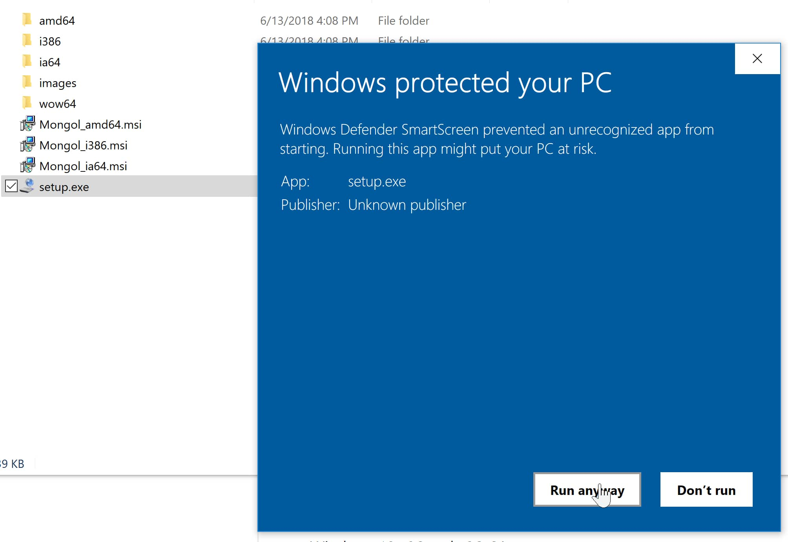
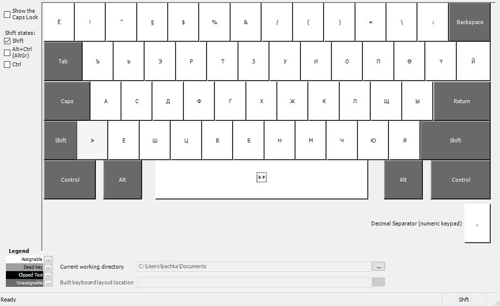
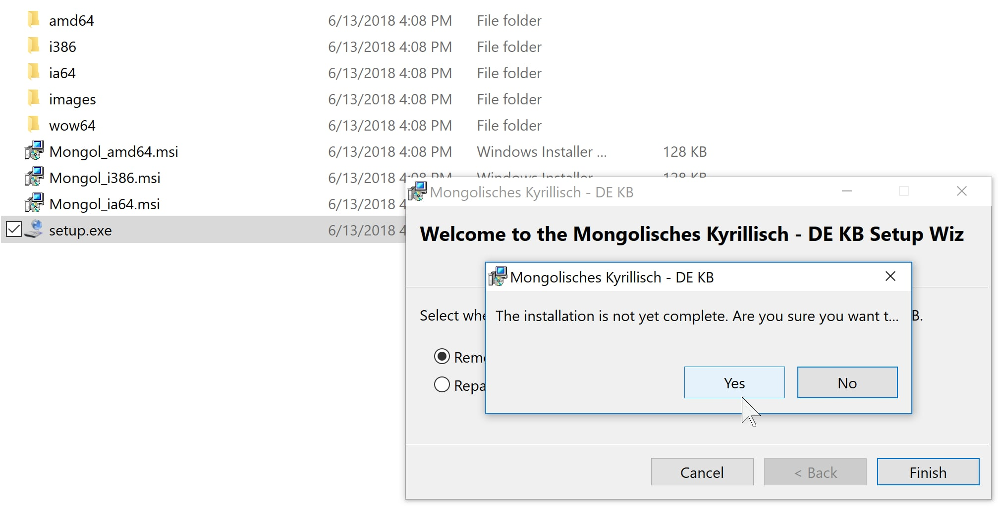

# Angepasste mongolische Tastatur-Layout auf deutschen Tastaturen
### Meine private zum schnell Schreiben angepasster Tastatur Layout
>_Wurde auf Windows 7, 10 Versionen, aber gebe Euch keine Garantie_, 🤣😂!
>_Wenn du irgendwelche Fragen bezüglich dieses Thema hast, schreib mir einfach private Message!_
- - -
Sprachen:
+ [–ú–æ–Ω–≥–æ–ª —Ö—ç–ª –¥—ç—ç—Ä —É–Ω—à–∏—Ö](README.mn.md)
+ [Read in English](README.md)

#### Inhaltsliste

+ [Wo kann ich herunterladen](#wo-kann-ich-herunterladen)
+ [Wie installiere ich](#wie-installiere-ich)
+ [Das Layout](#das-layout)
+ [Wie entferne ich oder repariere ich die Installation](#wie-entferne-ich-oder-repariere-ich-die-installation)
+ [ToDo](#todo)
+ [Historie](#historie)
- - -
### Wo kann ich herunterladen

 1. Öffne bitte die Seite der Release wo die ZIP-Datei freigegeben ist, indem Sie oben auf "release" klicken.

 2. Nun können Sie die Datei herunterladen. 
+ Sobald Sie mit dem Herunterladen fertig sind, entpacken Sie diese und folgen Sie die Anweisungen unten. 
- - -
### Wie installiere ich

 1. Starte die Installation mit setup.exe . Manchmal kommt die Meldung diesem Fenster, einfach auf "More Info(Mehr Info)" klicken, um weiter zur Installation gelangen ...  

 2. Im nächsten Fenster klicken wir einfach auf "Run anyway" starten die Installation endlich ...  

 3. Nach dem Sie als Administrator die Berechtigung für die Installation mit Ja akzeptiert haben, kommt gleich die Erfolgsmeldung ...  
+ Ich empfehle Ihnen Windows gleich neuzustarten, da meistens diese im laufenden System diese nicht begreift, dass da was neues hingekommen ist, üòÅ.

 4. Starte neu und dann checke in der Statusleiste, ob die Sprache zusätzlich präsentiert wird!

- - -

### Das Layout

+ Normalerweise wechselt man zwischen der Sprachen mit den Tastenkombination "Shift + Alt", aber wenn Sie was anders entdeckt haben, einfach mir Bescheid geben. Dann aktualisiere ich hier auch.
+ Sprachen müssen in jeder Applikation individuell eingestellt werden müssen und in diesem Fall in jeder Text-Applikation.
+ Ich weiss ned, wer diese Tastatur Layout erstellt hat. Auf jeden Fall kein normal denkendes Mensch! Dümmer geht es ned!!! 
Ein Beispiel:
+ Englisch A [a]= –ú–æ–Ω–≥–æ–ª –ê [a]
+ Englisch B [b]= –ú–æ–Ω–≥–æ–ª –ë [b]
+ Englisch K [k]= –ú–æ–Ω–≥–æ–ª –ö [k]
+ Englisch E [e] = –ú–æ–Ω–≥–æ–ª –≠ [e]
+ Englisch O [o] = –ú–æ–Ω–≥–æ–ª –û [o]
+ Englisch G [g] = –ú–æ–Ω–≥–æ–ª –ì [g]
+ u.s.w. eigentlich alle Buchstaben auf lateinischen Buchstaben Keyboard fast direkt reproduzierbar. Nur leider nicht gemacht, man will ned ändern, wow!!!

 1. Normale Ansicht  

 2. Mit Shift Taste  

 3. Mit Alt Gr Taste 

 4. Mit Schift + Alt Gr Tasten  

 5. Mit Caps Lock  
- - -

### Wie entferne ich oder repariere ich die Installation

+ To remove the installation use the installer again. Just start setup.exe again and then you will see a windows on picture below
 1. To remove or repair the installation  

 2. Removed successful  

 3. Or you can just cancel it  
- - -
### ToDo

+ If there is issues for my installation or somebody have idea how to improve the usage of mongolian language keyboard layout then welcome.

### Historie
+ i think now we have this final relaese which i present you
+ used many different ways to use my own custom layout
+ the first version made about 18 years ago. i used at these time an russian language dll changer
+ i found original mongolian layout of microsoft very poor. it is just nothing with linguistic or language to do
- - -
Made with ‚ù§ by Bachka 
