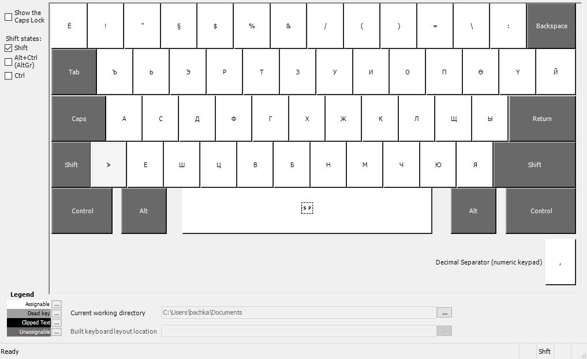

# Монгол үсгийн компъютерийн гарны тусгай тохируулга
### Монгол хэл дээр герман хэлний товчлуур дээр хурдан бичих тохируулга
>_Виндовсын 7 болон 10 дээр туршсан болно_, 🤣😂!
>_Хэрвээ янзан бүрийн асуудал буюу сайжруулах талаар санаа оноо байвал хувийн мессажаар харицана уу!_
- - -
Гадаад хэл дээр унших:
+ [Read in English](README.md)
+ [Auf deutsch lesen](README.de.md)

#### Агуулгын жагсаалт

+ [Хаанаас татаж авах](#хаанаас-татаж-авах)
+ [Хэрхэн суулгах талаар](#хэрхэн-суулгах-талаар)
+ [Аль товч дээр ямар үсэг тохирогдсон](#аль-товч-дээр-ямар-үсэг-тохирогдсон)
+ [Хэрхэн системээс устгах эсвэл засварлах](#хэрхэн-системээс-устгах-эсвэл-засварлах)
+ [Сайжруулалт](#сайжруулалт)
+ [Үүх түүх](#үүх-түүх)
- - -
### Хаанаас татаж авах

 1. Дээрхи линкүүдээс  release гэсэн дээр товшино уу.

 2. Дараагийн нээгдсэн хуудас дээрээс улаан хүрээлсэн ZIP-Файлыг татаж авна уу. 
+ Татаж дуусаныхаа дараа задаргаад тэр задарсан хавтастаа орж дараахи заавраар суулгана уу. 
- - -
### Хэрхэн суулгах талаар

 1. setup.exe -г ашиглан суулгацыг эхлүүлээрэй. Зарим тохиолдолд энэ цонх онгойх бөгөөд энэ тохиолдолд дараахи "More Info" дээр дар ...  

 2. Дараагийн цонх дээр "Run anyway" гэсэн товч дээр дар ...  

 3. Суулгацыг амжилттай ажиллуулахад тусгай эрхтэй ашиглагч шаардагдана. Тэр зөвшөөрлийг олгосоны дараа суулгац амжилттай болсон гэсэн мэдээлэл цонх дээр гарна ...  
+ Системийг шинээр унтрааж асаасан нь дээр бөгөөд энэ нөхцөлд Виндовс шинээр хэлний нэмэгдэл суусаныг мэдрэх болно.

 4. Унтрааж ахин асаасаныхаа дараа системийн мэдээлэлийн хэсэгт монгол хэлний товчлол харагдаж байгаа эсэхийг шалгаарай!

- - -

### Аль товч дээр ямар үсэг тохирогдсон

+ "Shift + Alt" товчлуурыг зэрэг даран систем дээр суусан хэлнүүдийн хооронд солино.
+ Бичвэр оруулах бүх програм дээрээ хэлийг нэг бүрчлэн сонгоно. 
+ Дараахи зурагнуудыг хэвлэж аваад эхний ээлжинд жаахан дасгал хийсэн нь дээр! Яагаад одоо болтол Microsoft тэнэг хүнд зориулж хийсэн гэмээр товчлуурын тохиргоог бидний хэдэн монголд ашиглуулж байгааг ойхгүй л байна.

 1. Ердийн нөхцөл  

 2. Shift-Товчлуурыг дарахад  

 3. Alt Gr - Товчлуурыг дарахад  

 4. Schift + Alt Gr товчлуурыг зэрэг дарахад  

 5. Caps Lock - Товчлуурыг дарахад  

- - -

### Хэрхэн системээс устгах эсвэл засварлах

+ Монгол хэлний товчлуурын тохиргоог устаг буюу засварлахын тулд суулгацыг ахин ажиллуулна уу. Үүний тулд setup.exe-г ахин эхлүүл. Үүний дараа онгойсон цонх дээр устгах эсвэл засварлах эсэхийг сонгоно.
 1. Устгах (Remove) эсвэл засварлах (Repair)  

 2. Aмжилттай устгалаа  

 3. Эсвэл түтгэлзэн зогсооё  
- - -
### Сайжруулалт

+ Хэрхэн сайжруулах талаар санаа оноог мэдээж би өөрөө цаг заваараа шалган боломжтой бөгөөд үр өгөөжтэй асуудал бол мэдээж шинэчлэн оруулах болно.

### Үүх түүх
+ За энэ хэсгийг дараа нь орчуулж бичье ...
+ i think now we have this final relaese which i present you
+ used many different ways to use my own custom layout
+ the first version made about 18 years ago. i used at these time an russian language dll changer
+ i found original mongolian layout of microsoft very poor. it is just nothing with linguistic or language to do
- - -
Бачка ❤-аараа бүтээв.